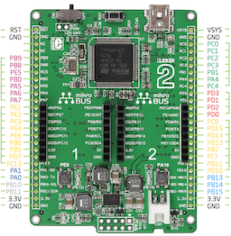

# CLICKER2

date | version | author | Remark
- | - | - | -
2016-08-27 | 1.0 | Roland van Straten | initial port
2016-12-10 | 1.1 | Roland van Straten | Use UART Pin definitions



CLICKER2 is a ```STM32F407VGT6``` based board that features two module connectors, two switches, two LEDs, and a single cell Li-Ion battery charger.

More information: [mikroe clicker2 website](http://www.mikroe.com/stm32/clicker-2/)

## Building firmware
Following assumes that the path to `micropython` local repository is at `$HOME/workspace/`.

```
cd $HOME/workspace/micropython/stmhal/boards
git clone https://github.com/rolandvs/CLICKER2.git
cd ..
make BOARD=CLICKER2
```


## Changes to micropython

### Board Specific

Added directories:<br>
```stmhal/boards/CLICKER2/``` with all board specific files.

```stmhal/boards/CLICKER2/documents/``` with the latest hardware documentation.

```stmhal/boards/CLICKER2/scripts/``` with micropython board support scripts.

### micropython sthal core code

- In the ```Makefile``` the ```USE_PYDFU ?= 0``` is changed from ```1``` to ```0```. This is for convenience using ```deploy``` in the make command.

- The ```stmhal/main.c``` is changed to have a different Flash drive name ```CLICKER2```. The use of ```#define MICROPY_HW_FLASH_LABEL	(1)``` sets the name to the board.

- In the ```stmhal/storage.c``` the extra segment of Flash memory is enabled. This is implemented as ```#define MICROPY_HW_FLASH_EXTRA (1)``` in ```mpconfigboard.h```.

- The left switch ```T2``` is the ```USRSW``` as far as micropython is concerned.

- ```LED1``` and ```LED2``` are defined.

### Patches

#### main.c
```
// set label
// - patched to give flashdrive the name of the board
#if defined(MICROPY_HW_FLASH_LABEL)
f_setlabel("/flash/"MICROPY_HW_BOARD_NAME);
#else
f_setlabel("/flash/pybflash");
#endif
```
#### storage.c
```
// enable this to get an extra 64k of storage (uses the last sector of the flash)
// - patched for clicker2 board
//#if 0
#if defined(MICROPY_HW_FLASH_EXTRA)
#define FLASH_MEM_SEG2_START_ADDR (0x080e0000) // sector 11
#define FLASH_MEM_SEG2_NUM_BLOCKS (128) // sector 11: 128k
#endif
```
## Board IO Pins

Board Label | CPU Pin | Description
- | - | -
LD1 | PE12 | LED 1 (left), active low
LD2 | PE15 | LED 2 (right), active low
SW | PE0 | PYB switch, active low
T2 | PE0 | left switch, active low
T3 | PA10 | right switch, active low
SENSEL | PB12 | select the battery measurement circuit
VSENSE | PC5  | the battery voltage ADC channel
FAULT | PC6 | status of the `FAULT` pin, active low
BATSTAT | PD4 | status of the `CHARGE` pin, active low

## Board Support Package
A small BSP package is placed in `stmhal/boards/CLICKER2/scripts/` and can be used like:

```
import bsp
clicker2 = bsp.BSP()
```
Some code to exercise the functions is executed through `execfile('bsp.py')`.

The functions are:

### ReadBatteryVoltage()
The battery voltage will return the voltage measured at the battery using a voltage divider.

```
batval = clicker2.ReadBatteryVoltage()
print("Battery voltage is: {:4.2f}.".format(batval*9.9/4096))
```
### ReadChargerStatus()
This reads the two status pins ```/CHARGE``` and ```/FAULT``` of the power supply and returns them.

### IsChargerActive()
Returns ```True``` if charging.

### IsFaultActive()
Returns ```True``` if power supply generates a fault signal.

### IsButtonxPressed()
Return ```True``` if button is pressed when calling ```IsButton1Pressed()``` or ```IsButton2Pressed()```.
